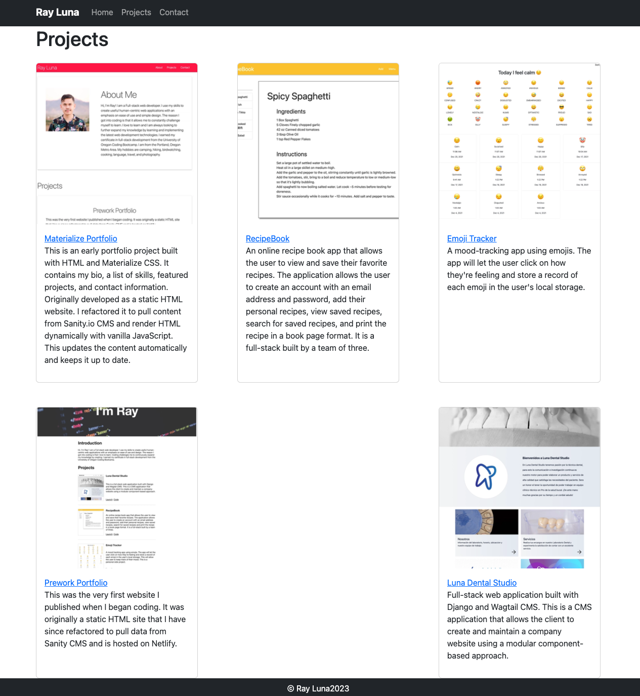

# bootstrap-portfolio

This is an early developer portfolio project built with HTML and Boostrap CSS. I have refactored the orginal static site to pull content from Sanity.io CMS and render HTML dynamically with Alpline.js. This updates the content automatically and keeps it up to date.

Project URL: [https://bootstrap-portfolio-rldev.netlify.app/](https://bootstrap-portfolio-rldev.netlify.app/)

## Technologies

- HTML5
- Bootstrap CSS
- JavaScript
- Alpine.js
- Vite.js
- Sanity.io
- GROQ
- Netlify

