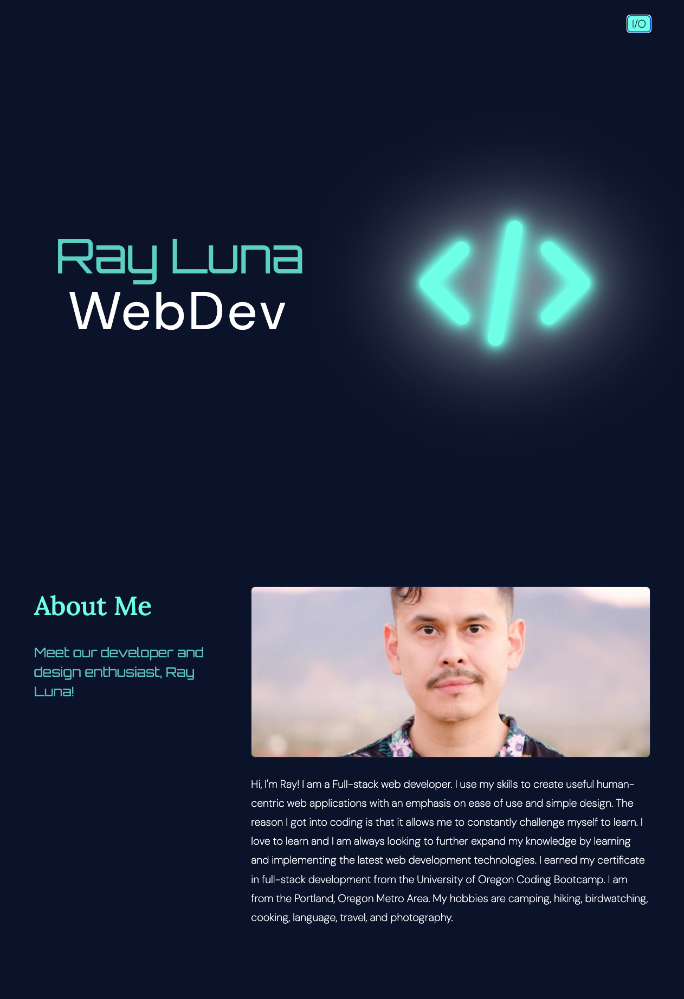

# Alpine.js Developer Portfolio

Web developer portfolio project built with HTML5, Alpline.js and Tailwind CSS. 

This project was originally built with static HTML and Bootstrap. The original static site was refactored to pull content from Sanity.io via API and render the HTML dynamically with Alpline.js. This updates the content automatically and keeps it up to date.

Project URL: [https://alpinejs-portfolio-rldev.netlify.app/](https://alpinejs-portfolio-rldev.netlify.app/)

## Technologies

- Alpine.js
- CSS3
- HTML5
- JavaScript
- Netlify
- Sanity.io
- TailwindCSS
- Vite.js

## Images

