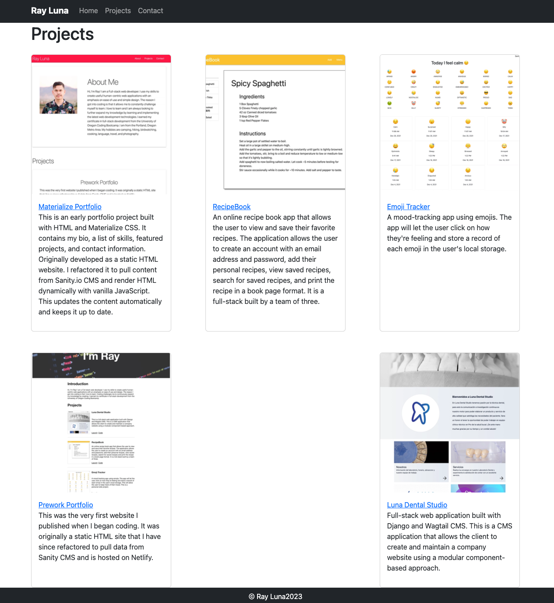

# bootstrap-portfolio

This is an early developer portfolio project built with HTML and Boostrap CSS. It uses a customized Bootstrap theme with Sass. The original static site was refactored to pull content from Sanity.io via API and render the HTML dynamically with Alpline.js. This updates the content automatically and keeps it up to date.

Project URL: [https://bootstrap-portfolio-rldev.netlify.app/](https://bootstrap-portfolio-rldev.netlify.app/)

## Technologies

- Alpine.js
- CSS3
- HTML5
- JavaScript
- Netlify
- Sanity.io
- TailwindCSS
- Vite.js

